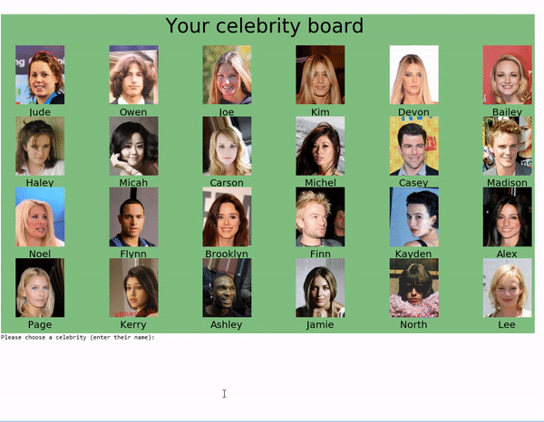

# Guess Who?! 

This project was a bit of fun to try to create a computer program that can play the board game Guess Who. I couldn't find images of the board game characters, so I used images of celebrities from the celebA dataset instead.

Check out a video of me playing the game here: https://www.youtube.com/watch?v=at_p4a25OJk&feature=youtu.be

training.py: Creates and trains image recognition models trained to recognise each of the 40 attributes in the dataset.  
game.py: Plays the game of Guess Who in the console (using the trained models).

Instructions:
Run training.py first, then run game.py. The game will be started in the terminal.

## How the program works
Firstly, training.py trains the models to recognise each of the 40 attributes in the celebA dataset, i.e. hair colour, gender etc.
Once trained, 24 celebrities in the test dataset are randomly selected for the game, and the model makes a prediction for each of the 40 attributes on each of these celebrities.  
The game starts with the user selecting their celebrity (the computer program randomly selects theirs). Note that the names in the celeba dataset are anonymised, so i gave each of them fake unisex names.
The algorithm and the user take turns asking questions and answering them about the celebrities, until someone takes a guess. If the guesser is correct they win, if wrong they lose, and the game ends after the guess.

The computer program's question asking 'strategy' is to choose the attribute which will remove as close to half of the remaining celebrities as possible (i.e. half of its remaining celebrities can be removed).  

The downside of this game is that many of the questions that can be asked are subjective, and the model has an average accuracy of around 85% (I haven't been able to train it for a long time yet, my PhD algs take priority at the moment!). This means that there can be disagreement over whether a celebrity should have been removed from the board or not, and often results in the final guess of a celebrity being incorrect.

## Dataset
CelebA dataset (http://mmlab.ie.cuhk.edu.hk/projects/CelebA.html), which is available on Kaggle: https://www.kaggle.com/jessicali9530/celeba-dataset  
202,599 number of face images of various celebrities 10,177 unique identities, but names of identities are not given 40 binary attribute annotations per image 5 landmark locations.

The image recognition model is the Inception v3 model, which i got from Kaggle. For each of the celeba attributes, I retrained the last few layers using transfer leaerning. It can be downloaded from: http://download.tensorflow.org/models/inception_v3_2016_08_28.tar.gz

## Credits
This script started life as Marcos's gender recognition kaggle notebook: http://www.kaggle.com/bmarcos/image-recognition-gender-detection-inceptionv3/notebook
thanks Marcos!
